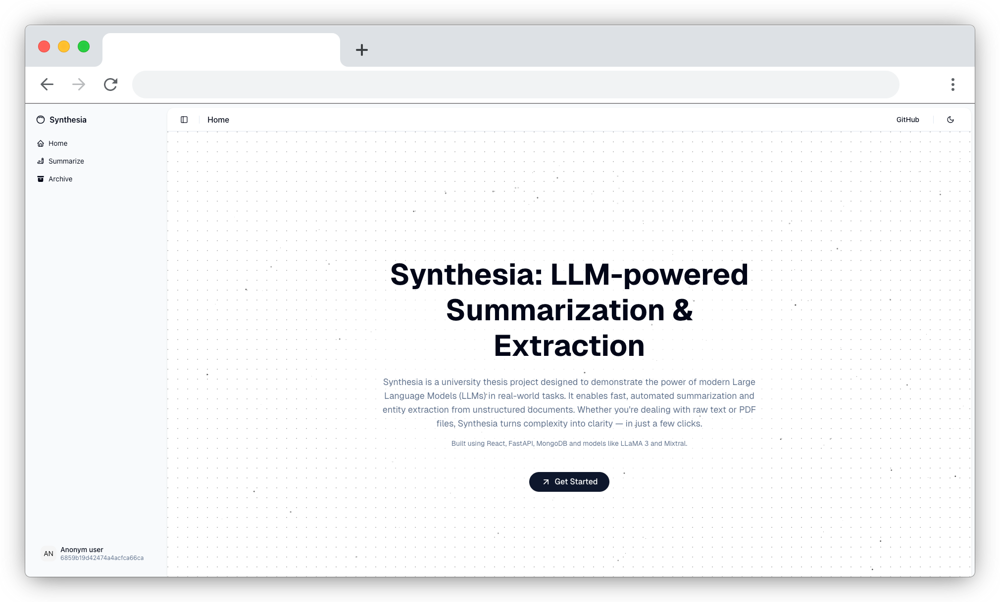
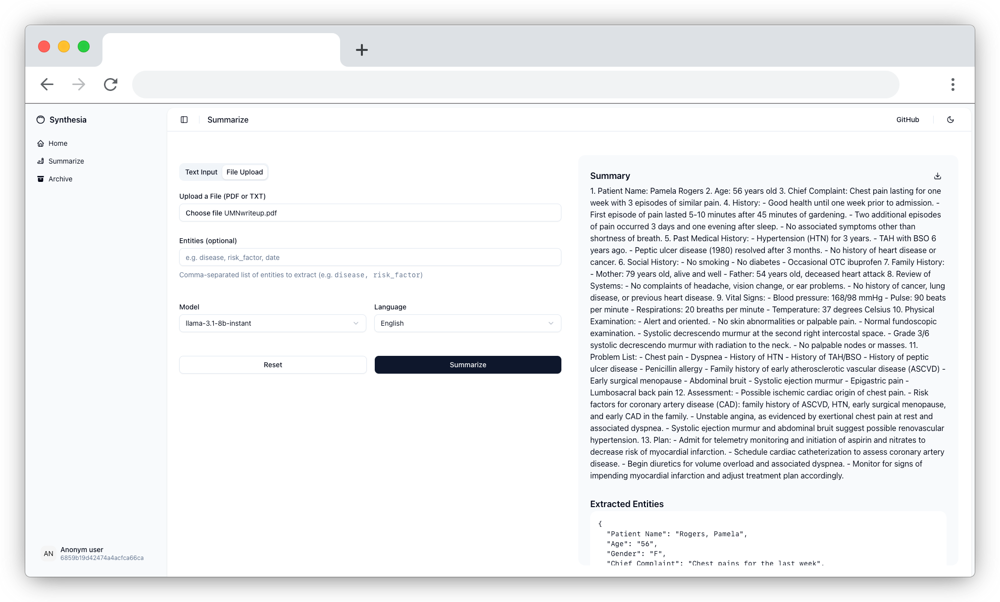
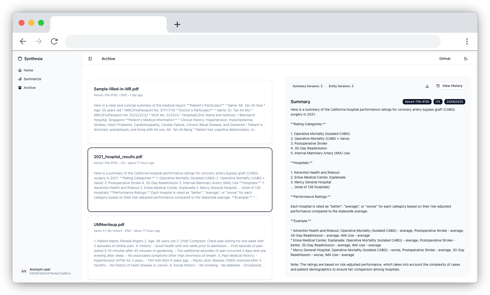

# Synthesia Frontend

Synthesia is a web-based document intelligence application that leverages LLMs (Large Language Models) to extract key information and generate concise summaries from complex documents.

This repository contains the frontend codebase, developed using **React**, **TypeScript**, and **Next.js**. The user interface is designed with accessibility and responsiveness in mind, utilizing **shadcn/ui** components for a clean and modern experience.

## 🌐 Live Application

> The frontend interfaces with the backend available here: [Synthesia Backend](https://github.com/Tratt0re/Synthesia_BE)

## 📁 Project Structure

```
frontend/
├── src/
│   ├── app/                  # Main Next.js App Router
│   │   ├── archive/          # Archive page
│   │   │   └── id/           # Detail view for summaries
│   │   ├── summarize/        # Text summarization page
│   │   ├── layout.tsx        # Global layout
│   │   └── page.tsx          # Landing page
│   ├── components/           # Reusable UI components
│   │   ├── archive/          # Archive-specific components
│   │   ├── summarize/        # Summarization-specific components
│   │   └── ui/               # Shared UI elements (header, footer, etc.)
│   ├── contexts/             # React Context API (e.g. theme context)
│   ├── hooks/                # Custom React Hooks
│   ├── lib/                  # Utility functions and helpers
│   ├── services/             # Axios services for backend communication
│   ├── styles/               # Global styles and variables
│   └── types/                # Shared TypeScript types
```

## 📸 Screenshots

- **Home Page (Landing)**
  

- **Summarization Page**
  

- **Archive View**
  

## 🛠 Technologies

- [React](https://reactjs.org/)
- [Next.js](https://nextjs.org/)
- [TypeScript](https://www.typescriptlang.org/)
- [Shadcn/UI](https://ui.shadcn.com/)
- [Axios](https://axios-http.com/)
- [Tailwind CSS](https://tailwindcss.com/)

## 🚀 Getting Started

```bash
npm install
npm run dev
```

## 📝 License

Distributed under the **Apache 2.0 License**.  
See `LICENSE` for more details.

---

## 👤 Author

**Salvatore De Luca**  
Bachelor Thesis – 2025  
Università Pegaso
